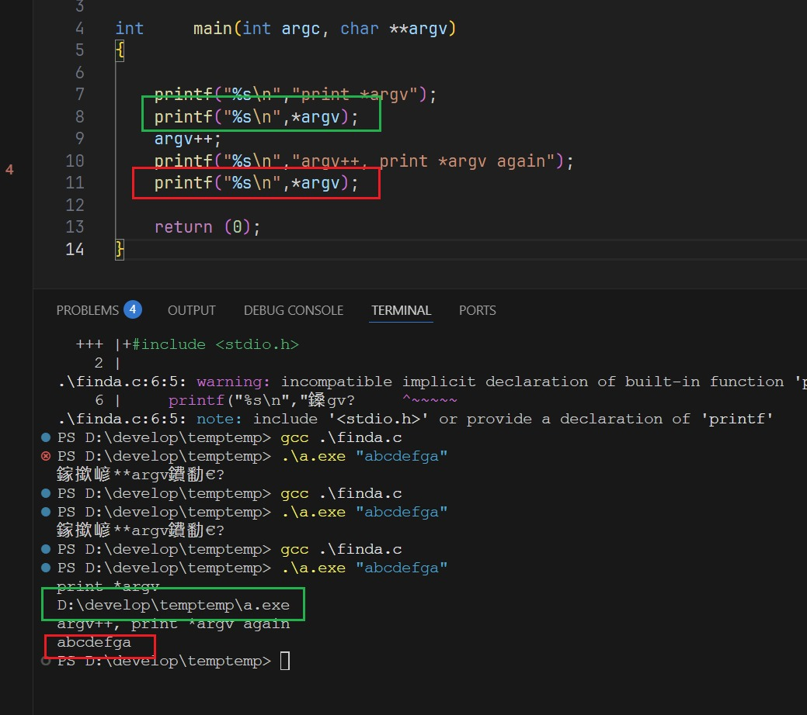

Assignment name  : aff_a
Expected files   : aff_a.c

Allowed functions: write
--------------------------------------------------------------------------------

Write a program that takes a string, and displays the first 'a' character it
encounters in it, followed by a newline. If there are no 'a' characters in the
string, the program just writes a newline. If the number of parameters is not
1, the program displays 'a' followed by a newline.
```c
#include <unistd.h>

int		main(int argc, char **argv)
{
	if (argc != 2)
		write(1, "a", 1);
	else
	{
		while (*argv[1])
		{
			if (*argv[1] == 'a')
			{
				write(1, "a", 1);
				break;
			}
			argv[1]++;
		}
	}
	write(1, "\n", 1);
	return (0);
}
```
`int argc 和 char **argv 是 main 函数的命令行参数。`

`int argc (argument count):`
`表示程序运行时传入的参数个数`
`包括程序名称本身`
`程序名称算作第一个参数，所以 argc 最小值是 1`
`char **argv (argument vector):`
`是一个指向字符串数组的指针`
`存储所有的命令行参数`
`argv[0] 是程序名称`
`argv[1] 是第一个参数`
`argv[2] 是第二个参数，以此类推`
`argv[argc] 是 NULL`
`char **argv，假设我们传入的参数为hello`
`argv指向一个指针数组，也就是数组里面的元素都是指针。（这个例子里就是字符串指针，分别指向程序名和hello）`
`argv里的每一项，也就是argv[i],就是指向具体字符串的指针,比如argv[1]就指向了hello`

`对于argv[1]来说，既然它是一个指向字符串的指针，那么*argv[1],它的初始值就是‘h’,。`
`此时，如果移动argv[1]的指针，也就是argv[1]++，那么指针就移动到了e的位置，值就是‘e’`

`如果用你上面的二维数组来解释，也可以。那既然argv[1]是指向这个字符串，那么显然，argv[1][0]，就是字符串里的第一个字符，也即是*argv[1]，两者一样。一个是指针解释，一个是数组解释。`

理解到这里我觉得就行了，我再做一些测试。


argv[i]，其实也能用*argv来表示（注意，后面没有中括号）；只不过，因为我们只需要argv[1]，因此就没有必要去挨个移动大指针，而是直接去取argv[1]就可以了。可以看我的代码。

`argv++之后，*argv = argv[1] = 传入的字符串hello`
`而*argv1，自然就是字符h，argv[1]++，*argv1就是字符e。`
`换言之，argv++之后`
`既然*argv=argv[1]=hello，那么**argv = argv[1] = h`
`就是这样两层关系。`

`并且我自己手写了一个函数，用str来做参数，还原了一样的效果。`
`实际上，int test2(char str)，其实，就表示str是个二维数组`
`第一维度移动指针，就是在不同的字符串上移动；`
`第二维度移动指针，就是在某个字符串上的字符上移动。`
`第一维度的指针具有优先性，当你大指针移动到数组的第二个元素时，那么此时的小指针，也必须移动到第二个字符串上。`
`换言之，str[0][0]，表示第一个字符串的第二个字符，如果你移动大指针，变成str[1][0]，那此时小指针只能'跟着它动，取到第二个字符串[0]。`
